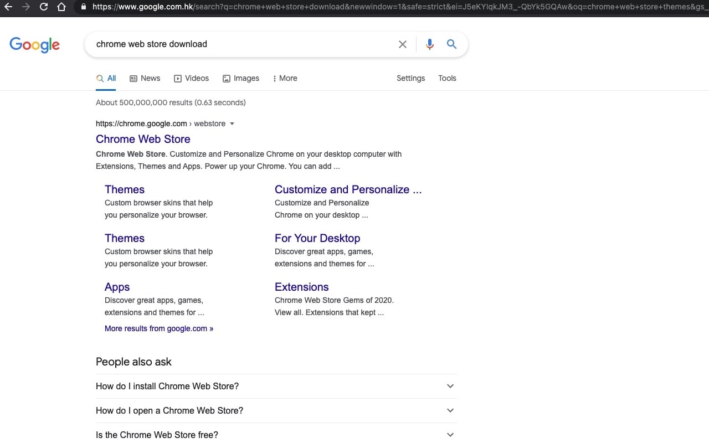
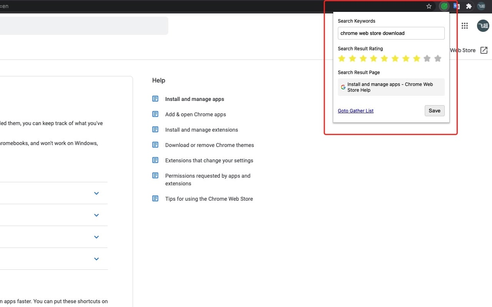
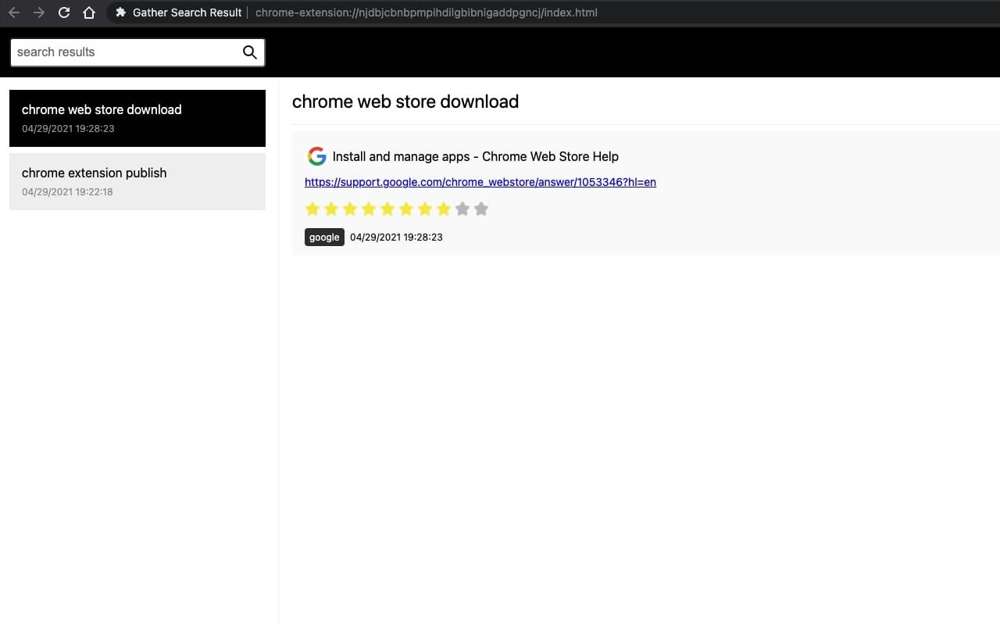

A lot of times when we search something in broswer, it's just a single search, it's just solve your problem once. 
And when you encounter this problem again, what should you do? You search again, again and again~

So, this is a broswer plugin, it can help you remeber what you get during one search~

How to use?

 1. [install it](https://chrome.google.com/webstore/detail/gather-search-result/cnmbkobgfccpeoihfhhkbphepmhcdiih?hl=zh-CN&authuser=0)
 2. search something, eg. I Google "chrome web store download"
  
 3. click a link and goto a result page, then click the plugin icon to save the result, you can grade the result and you can save many results about this seach.
  
 4. click the "Goto Gather List" hyperlink, you will goto the results page.
  
 5. when you open a result link again, I will suggest you to search the keywords again.
  

So, enjoy~
